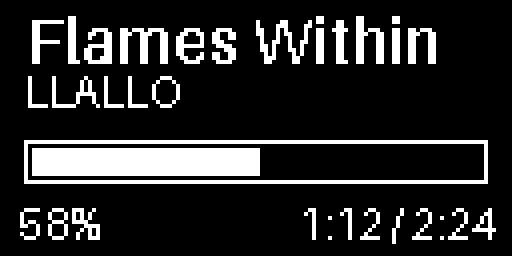

# PC Spotify Media Playback Controller with OLED screen



# Communication Protocol

1) Synchronisation | Media Change (Change to a different song)
```
$PREFIX:VALUE*CHECKSUM\n
```
where:

* **($)** - the start packet marker
* **(PREFIX)** - target parameter to be updated
* **(:)** - delimeter between PREFIX and VALUE it's being updated to
* **(VALUE)** - update value the PREFIX (parameter) is going to be updated to
* **(*)** - CHECKSUM start marker indicating that next digits are for the correction check
* **(CHECKSUM)** - checksum value (2 hexadecimal digits, either as a final value or a xor operand to result in a 0 xor checksum)
* **(\n)** - end of the packet marker

Example of a Transmitted Packet (Uses URL Percent-Encoding-Decoding) 

```
$TITLE:Rock%20%26%20Roll%3A%20The%20Best%20%2AHits%2A%20%2410%21%20%0A*2C\n

from the raw value: Rock & Roll: The Best *Hits* $10! \n
```